# Przedrostek_WDPI2025 – Aplikacja Ruletka

Aplikacja webowa z mechaniką ruletki, systemem ulepszeń i panelem administracyjnym.

---

## Diagram ERD

<!-- TODO: Dodaj obrazek ERD -->
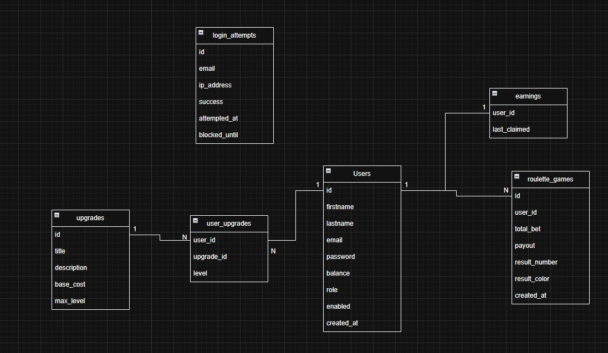

[(.drawio)](preview/diagramerd.drawio)

---

## Screeny aplikacji

<!-- TODO: Dodaj screeny -->
Logowanie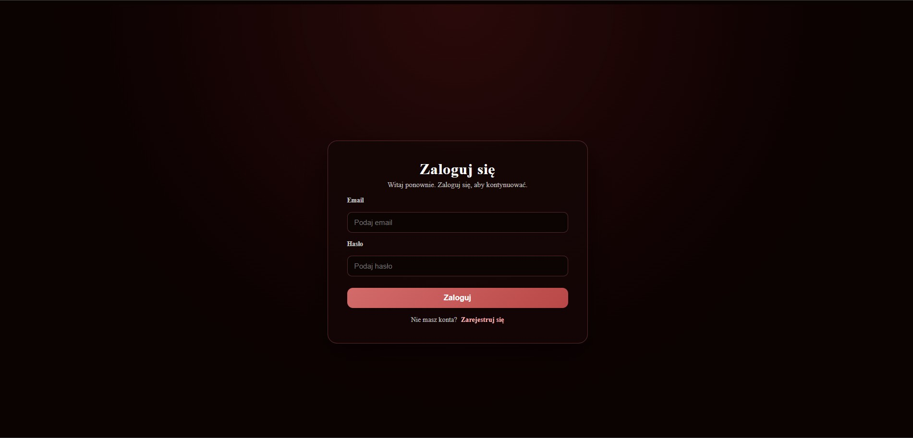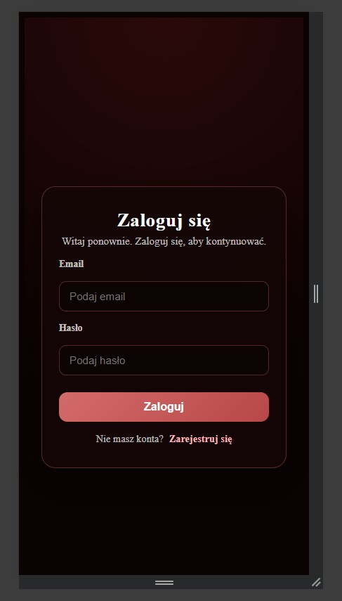

Ruletka 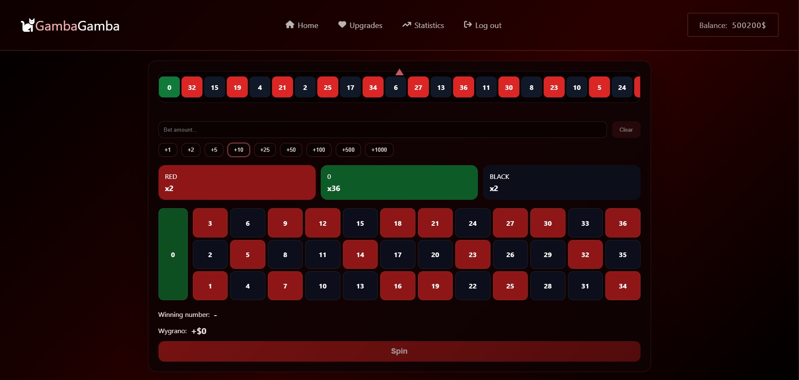 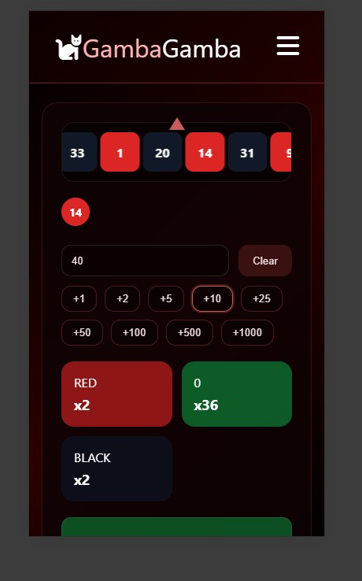

Ulepszenia 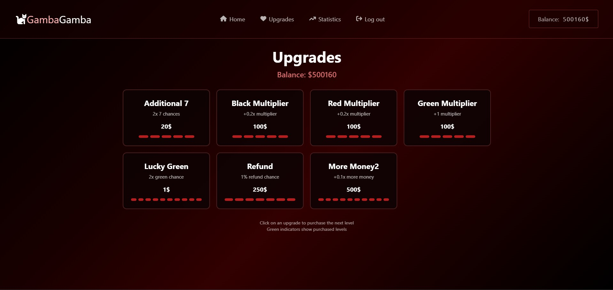 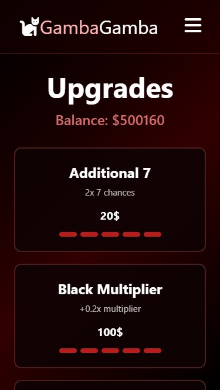

Statystyki 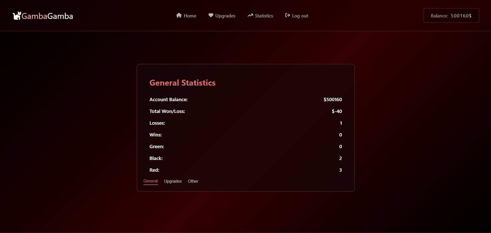 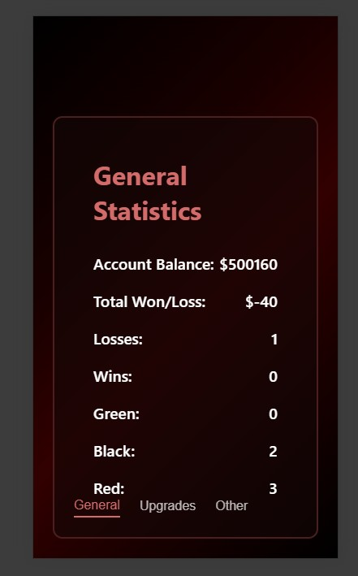

Panel Admina 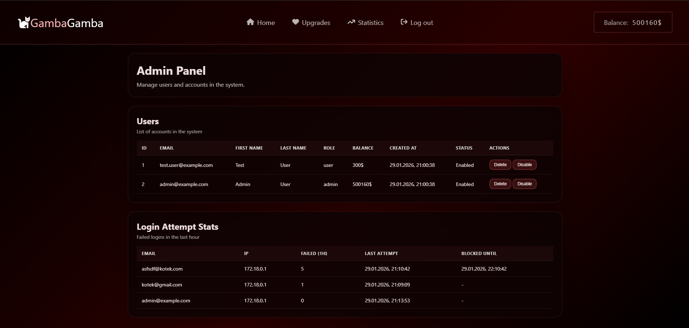 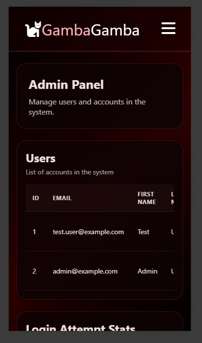

---

## Architektura aplikacji (MVC)

```
#1. Views
-public/views/*.html
-public/scripts/*.js
-public/styles/*.css


#2. Controllers
-index.php
-Middleware: AllowedMethods, RequireLogin 
-Routing.php
-src/controllers/*Controller.php
-Middleware: AllowedMethods, RequireLogin


#3. Model / Service
-src/models/*Definition.php
-src/Services/*.php


#4. Repository
src/repository/*Repository.php


#5. Database(PostgreSQL)
- users
- upgrades
- user_upgrades
- roulette_games
- earnings
- login_attempts


## FLOW
1. Przeglądarka → Fetch API
2. index.php
3. Routing.php
4. Middleware
5. Kontroler
6. Serwis
7. Repozytorium
8. PostgreSQL
9. Odpowiedź do frontendu

```
---

## Instrukcja uruchomienia

### Wymagania
- Docker + Docker Compose

### Uruchomienie
```bash
docker compose up --build
```

Aplikacja dostępna pod: **http://localhost:8080/login**

### Konta testowe
| Email | Hasło | Rola |
|-------|-------|------|
| `test.user@example.com` | `Kotek1234%` | user |
| `admin@example.com` | `Kotek1234%` | admin |

### Zmienne środowiskowe (.env.example)
```env
DB_USER=docker
DB_PASS=docker
DB_HOST=db
DB_NAME=db
```
---

##  Scenariusz testowy

### 1. Logowanie użytkownika
1. Wejdź na `/login`
2. Wpisz `test.user@example.com` / `Kotek1234%`
3. Przekierowanie na `/roulette`

### 2. Test uprawnień (403)
1. Zaloguj się jako `test.user@example.com`
2. Wejdź na `/admin-panel`
3. Wyświetla się strona 403 (brak uprawnień)

### 3. Test bez logowania (401)
1. Wyloguj się (`/logout`)
2. Wejdź na `/roulette`
3. Wyświetla się strona 401

### 4. Test braku strony (404)
1. Wejdź na `http://localhost:8080/login/fasdfa`
2. Wyświetla się strona 404

### 4. Role – panel admina
1. Zaloguj się jako `admin@example.com` / `Kotek1234%`
2. Wejdź na `/admin-panel`
3. Widoczna lista użytkowników, możliwość blokowania/usuwania

### 5. CRUD – ulepszenia
1. Zaloguj się jako user
2. Wejdź na `/upgrades`
3. Kup ulepszenie (POST `/api/upgrades`)
4. Saldo zmniejszone, poziom ulepszenia zwiększony

### 6. Test widoków i funkcji SQL
- `v_user_game_stats` – agreguje statystyki gier
- `v_login_attempt_stats` – podsumowanie prób logowania
- Funkcja `total_upgrades_cost(user_id)` – koszt ulepszeń
- Trigger `trg_users_earnings` – tworzy rekord earnings po INSERT do users

---

## Checklista funkcjonalności

### ARCHITEKTURA APLIKACJI MVC
Aplikacja używa wzorca MVC:
- **Model**: `src/models/` (np. `UserDefinition.php`)
- **View**: `public/views/*.html`
- **Controller**: `src/controllers/*Controller.php`

### KOD NAPISANY OBIEKTOWO (CZĘŚĆ BACKENDOWA)
```php
// src/models/UserDefinition.php
class UserDefinition {
    public function __construct(
        public int $id,
        public string $email,
        public string $password,
        public string $firstname,
        public string $lastname,
        public string $role,
        public int $balance
    ) {}
    
    public static function findByEmail(string $email): ?self {
        $repository = new UserRepository();
        $row = $repository->getUserByEmail($email);
        return $row ? self::fromArray($row) : null;
    }
}
```

### FETCH API (AJAX)
```javascript
// public/scripts/roulette.js
const response = await fetch('/api/roulette', {
    method: 'POST',
    headers: { 'Content-Type': 'application/json' },
    body: JSON.stringify({ action: 'spin', bets })
});
const data = await response.json();
if (!data.success) {
    throw new Error(data.error || 'Spin failed');
}
```

### RESPONSYWNOŚĆ
Aplikacja wykorzystuje CSS z media queries i jednostkami względnymi.

### LOGOWANIE
```php
// src/controllers/SecurityController.php
$user = UserDefinition::findByEmail($email);
if (!$user) {
    $blockedUntil = $this->recordFailedLogin($emailNormalized, $ipAddress);
    return $this->render("login", ["messages" => [self::GENERIC_INVALID_MESSAGE], ...]);
}
if (!password_verify($password, $user->password)) {
    $blockedUntil = $this->recordFailedLogin($emailNormalized, $ipAddress);
    return $this->render("login", ["messages" => [self::GENERIC_INVALID_MESSAGE], ...]);
}
// Sukces
$_SESSION = array_merge($_SESSION, $user->toSessionData());
```

### SESJA UŻYTKOWNIKA
```
1. Login POST -> password_verify() -> session_regenerate_id(true)
2. $_SESSION['user_id'], $_SESSION['user_role'], $_SESSION['user_balance']
3. Middleware checkAuthRequirements() sprawdza $_SESSION['user_id']
4. Logout -> session_destroy() + kasowanie ciasteczka
```

### UPRAWNIENIA UŻYTKOWNIKÓW
```php
// src/middleware/checkAuthRequirements.php
if (!empty($requiredRoles)) {
    $userRole = $_SESSION['user_role'] ?? RequireLogin::ROLE_USER;
    $isAdmin = ($userRole === RequireLogin::ROLE_ADMIN);
    if (!$isAdmin && !in_array($userRole, $requiredRoles, true)) {
        throw new \Exception("Brak uprawnień", 403);
    }
}
```

### ROLE UŻYTKOWNIKÓW – USER/ADMIN
```php
// src/annotation/RequireLogin.php
class RequireLogin {
    public const ROLE_USER = 'user';
    public const ROLE_ADMIN = 'admin';
    public array $roles;
    public function __construct(array $roles = [self::ROLE_USER]) {
        $this->roles = $roles;
    }
}

// Użycie w kontrolerze:
#[RequireLogin([RequireLogin::ROLE_ADMIN])]
```

### WYLOGOWYWANIE
```php
// src/controllers/SecurityController.php
public function logout() {
    $_SESSION = [];
    if (ini_get("session.use_cookies")) {
        $params = session_get_cookie_params();
        setcookie(session_name(), '', time() - 42000, $params["path"], ...);
    }
    session_destroy();
    header("Location: {$url}/login");
}
```

### WIDOKI, WYZWALACZE, FUNKCJE, TRANSAKCJE
```sql
-- docker/db/init/init.sql

-- WIDOK: statystyki gier użytkownika
CREATE VIEW v_user_game_stats AS
SELECT user_id, COUNT(*) AS total_games,
       COALESCE(SUM(total_bet), 0) AS total_bet,
       COALESCE(SUM(payout), 0) AS total_payout
FROM roulette_games GROUP BY user_id;

--WIDOK: próby logowania
CREATE VIEW v_login_attempt_stats AS
SELECT
    email,
    ip_address,
    COUNT(*) FILTER (WHERE success = FALSE AND attempted_at > NOW() - INTERVAL '1 hour') AS failed_last_hour,
    MAX(attempted_at) AS last_attempt_at,
    MAX(blocked_until) AS blocked_until
FROM login_attempts
GROUP BY email, ip_address;

-- TRIGGER: tworzenie rekordu earnings po utworzeniu użytkownika
CREATE OR REPLACE FUNCTION create_user_earnings() RETURNS trigger AS $$
BEGIN
    INSERT INTO earnings (user_id, last_claimed) VALUES (NEW.id, NULL);
    RETURN NEW;
END;
$$ LANGUAGE plpgsql;

CREATE TRIGGER trg_users_earnings
AFTER INSERT ON users FOR EACH ROW
EXECUTE FUNCTION create_user_earnings();

-- FUNKCJA: obliczanie kosztu ulepszeń
CREATE OR REPLACE FUNCTION total_upgrades_cost(p_user_id INT) RETURNS INT AS $$
    SELECT COALESCE(SUM(u.base_cost * (uu.level * (uu.level + 1) / 2)), 0)
    FROM user_upgrades uu JOIN upgrades u ON u.id = uu.upgrade_id
    WHERE uu.user_id = p_user_id;
$$ LANGUAGE SQL;
```

```php
// TRANSAKCJA: src/repository/userRepository.php
public function createUser(...): void {
    $connection = $this->database->connect();
    try {
        $connection->beginTransaction();
        $stmt = $connection->prepare('INSERT INTO users ...');
        $stmt->execute([...]);
        $connection->commit();
    } catch (Throwable $e) {
        if ($connection->inTransaction()) {
            $connection->rollBack();
        }
        throw $e;
    }
}
```

### AKCJE NA REFERENCJACH
```sql
-- docker/db/init/init.sql
CREATE TABLE earnings (
    user_id INTEGER PRIMARY KEY REFERENCES users(id) ON DELETE CASCADE,
    last_claimed TIMESTAMP NULL
);

CREATE TABLE user_upgrades (
    user_id INTEGER NOT NULL REFERENCES users(id) ON DELETE CASCADE,
    upgrade_id INTEGER NOT NULL REFERENCES upgrades(id) ON DELETE CASCADE,
    ...
);
```

---

## BEZPIECZEŃSTWO

### Ochrona przed SQL injection
```php
// src/repository/UserRepository.php
$stmt = $this->database->connect()->prepare('
    SELECT * FROM users WHERE email = :email
');
$stmt->bindParam(':email', $email, PDO::PARAM_STR);
$stmt->execute();
```

### Nie zdradzamy, czy email istnieje
```php
// src/controllers/SecurityController.php
private const GENERIC_INVALID_MESSAGE = 'Invalid Password or Email';

if (!$user) {
    return $this->render("login", ["messages" => [self::GENERIC_INVALID_MESSAGE], ...]);
}
if (!password_verify($password, $user->password)) {
    return $this->render("login", ["messages" => [self::GENERIC_INVALID_MESSAGE], ...]);
}
```

### Walidacja formatu email po stronie serwera
```php
// src/controllers/SecurityController.php
private function isValidEmail(string $email): bool {
    return filter_var($email, FILTER_VALIDATE_EMAIL) !== false;
}
```

### CSRF token w formularzu logowania
```html
<!-- public/views/login.html -->
    <input type="hidden" name="csrf" value="<?= htmlspecialchars($_SESSION['csrf'] ?? ''...); ?>">
```
```php
// SecurityController.php
if (!$this->verifyCsrfToken($csrfToken)) {
    return $this->render("login", ["messages" => ["Invalid request"], ...]);
}
```

### CSRF token w formularzu rejestracji
```html
<!-- public/views/register.html -->
<input type="hidden" name="csrf" value="<?= htmlspecialchars($csrfToken ?? '', ...); ?>">
```

### Limit długości wejścia
```html
<!-- public/views/login.html -->
<input type="password" minlength="8" maxlength="64" ...>
```
```php
// SecurityController.php
private const PASSWORD_MIN_LENGTH = 8;
private const PASSWORD_MAX_LENGTH = 64;

if (strlen($password) < self::PASSWORD_MIN_LENGTH || strlen($password) > self::PASSWORD_MAX_LENGTH) {
    return false;
}
```

### Hashowanie haseł (bcrypt)
```php
// src/controllers/SecurityController.php (register)
$hashedPassword = password_hash($password1, PASSWORD_BCRYPT);
```

### Hasła nie pojawiają się w logach

### Regeneracja ID sesji po logowaniu
```php
// src/controllers/SecurityController.php
session_regenerate_id(true);
$_SESSION = array_merge($_SESSION, $user->toSessionData());
```

### Limit prób logowania
```php
// src/controllers/SecurityController.php
private const MAX_LOGIN_ATTEMPTS = 5;
private const LOGIN_BLOCK_SECONDS = 3600;

private function recordFailedLogin(string $email, string $ipAddress): ?string {
    $recentFailures = $this->loginAttemptsRepository->countRecentFailures(
        $email, $ipAddress, self::LOGIN_BLOCK_SECONDS
    );
    $shouldBlock = ($recentFailures + 1) >= self::MAX_LOGIN_ATTEMPTS;
    $blockedUntil = $shouldBlock ? date('Y-m-d H:i:s', time() + self::LOGIN_BLOCK_SECONDS) : null;
    $this->loginAttemptsRepository->logAttempt($email, $ipAddress, false, $blockedUntil);
    return $blockedUntil;
}
```

### Walidacja złożoności hasła
```php
// src/controllers/SecurityController.php
private function isValidPassword(string $password): bool {
    if (strlen($password) < self::PASSWORD_MIN_LENGTH || strlen($password) > self::PASSWORD_MAX_LENGTH) {
        return false;
    }
    $hasNumber = (bool) preg_match('/\d/', $password);
    $hasSymbol = (bool) preg_match('/[^a-zA-Z0-9]/', $password);
    return $hasNumber && $hasSymbol;
}
```

### Sprawdzenie, czy email istnieje przy rejestracji
```php
// src/controllers/SecurityController.php
$existingUser = UserDefinition::findByEmail($email);
if ($existingUser) {
    return $this->render('register', ['messages' => [self::GENERIC_INVALID_MESSAGE], ...]);
}
```

### Escaping w widokach (XSS)
```php
<!-- public/views/login.html -->
<?= htmlspecialchars($message, ENT_QUOTES, 'UTF-8'); ?>
```

### Poprawne kody HTTP
```php
// index.php
if ($e->getCode() === 401) { http_response_code(401); include '401.html'; }
if ($e->getCode() === 403) { http_response_code(403); include '403.html'; }
if ($e->getCode() === 400) { http_response_code(400); include '400.html'; }

```

### Nie przekazujemy hasła do widoku
```php
// src/models/UserDefinition.php
public function toSessionData(): array {
    return [
        'user_id' => $this->id,
        'user_email' => $this->email,
        'user_role' => $this->role,
        'user_balance' => $this->balance
    ];
}
```

### Logowanie nieudanych prób (bez haseł)
```php
// src/repository/LoginAttemptsRepository.php
public function logAttempt(string $email, string $ipAddress, bool $success, ?string $blockedUntil = null): void {
    $stmt = $this->database->connect()->prepare('
        INSERT INTO login_attempts (email, ip_address, success, blocked_until)
        VALUES (:email, :ip_address, :success, :blocked_until)
    ');
}
```

### Poprawne wylogowanie – niszczenie sesji
```php
// src/controllers/SecurityController.php
$_SESSION = [];
setcookie(session_name(), '', time() - 42000, ...);
session_destroy();
```

---

---
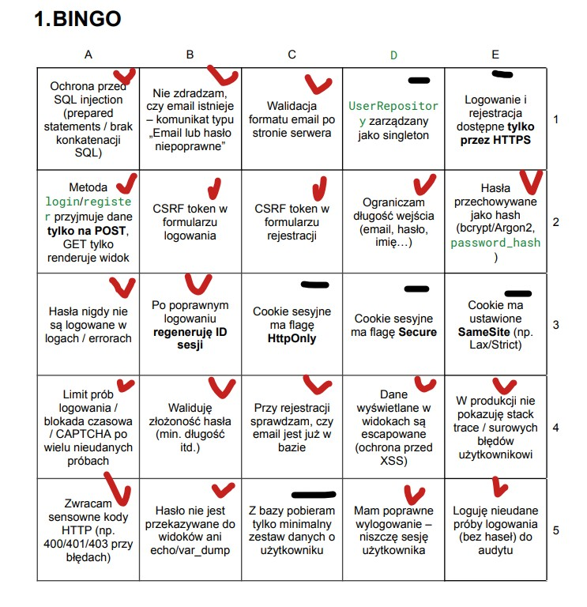
---

##  Dodatkowe funkcjonalności

- **System ulepszeń** – 7 typów ulepszeń modyfikujących szanse i wypłaty w ruletce
- **Dzienne zarobki** – automatyczne naliczanie bonusu przy logowaniu (`EarningsRepository`)
- **Statystyki gracza** – widok `/statistics`
- **Panel admina** – blokowanie/odblokowywanie kont, usuwanie użytkowników
- **Symulator ulepszeń** – skrypt `scripts/upgrade-sim.php` do testowania ulepszeń(php scripts/upgrade-sim.php)
- **Atrybuty PHP** – `#[AllowedMethods]`, `#[RequireLogin]` jako middleware

---

## Struktura projektu

```
├── index.php                 # Entry point
├── Routing.php               # Router
├── database.php              # Połączenie DB (Singleton)
├── docker-compose.yaml       # środowisko
├── docker/
│   ├── db/init/init.sql      # definicja bazy danych + przykładowe rekordy
│   ├── nginx/                # Konfiguracja nginx
│   └── php/                  # Dockerfile PHP
├── public/
│   ├── views/                # HTML
│   ├── scripts/              # JavaScript
│   └── styles/               # CSS
├── src/
│   ├── annotation/           # Atrybuty PHP
│   ├── controllers/          # Kontrolery
│   ├── middleware/           # Middleware (auth, methods)
│   ├── models/               # Modele
│   ├── repository/           # Warstwa dostępu do danych
│   ├── Services/             # Logika ruletki
│   └── patterns/             # Wzorce (Singleton)
└── scripts/                  # Skrypty
```
